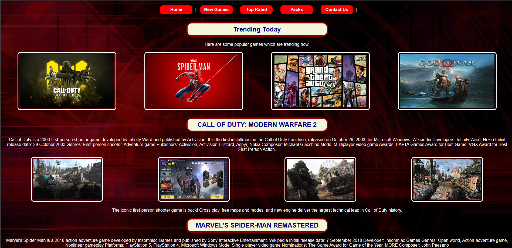

# Game Website

[Visit Game Website](https://swayam02072001.github.io/game_website/)

This project is a simple game website created using HTML and CSS. It provides a platform for users to play various online games, view game reviews, and explore gaming-related content.

## Features

- **Game Library**: Browse a collection of popular games and select one to play.
- **Game Reviews**: Read reviews and ratings for different games to help make informed decisions.
- **User Registration/Login**: Register an account or log in to access additional features such as saving favorite games or submitting reviews.
- **Responsive Design**: Ensures optimal viewing experience across various devices, including desktops, tablets, and mobile phones.

## Technologies Used

- **HTML**: Used for structuring the content of the website.
- **CSS**: Used for styling the elements and layout.
- **Bootstrap**: Frontend framework for responsive design and UI components.
- **JavaScript**: May be used for adding interactivity or dynamic content (not implemented in this version).

## Screenshots



## Usage

1. Clone the repository:

    ```bash
    git clone https://github.com/swayam02072001/game-website.git
    ```

2. Open the `index.html` file in your web browser to explore the website.

## Customization

- **Styling**: Modify the `style.css` file to customize the appearance of the website, including colors, fonts, and layout.
  
- **Content**: Update the HTML files to add new games, reviews, or additional pages as needed.

## Contributing

Contributions are welcome! Feel free to open an issue or submit a pull request with any improvements or additional features.

## License

This project is licensed under the MIT License. See the [LICENSE](LICENSE) file for details.

---
